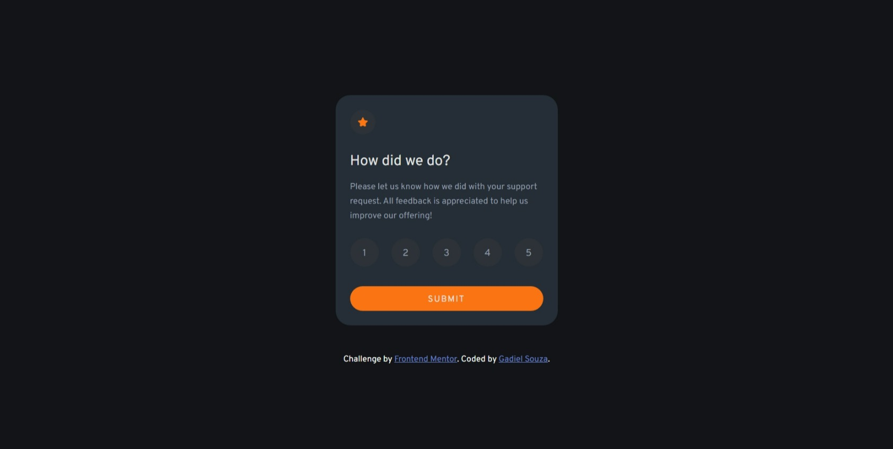

# Frontend Mentor - Interactive rating component solution

Essa é uma solução para o [Interactive rating component challenge on Frontend Mentor](https://www.frontendmentor.io/challenges/interactive-rating-component-koxpeBUmI). Os desafios do Front End Mentor te ajudam a melhorar seu código criando projetos realistas.

## Screenshot

## Objetivos

Usuários devem ser capazes de:

- Ver o Layout ideal para o app dependendo do tamanho de tela do aparelho
- Selecionar e enviar um número de avaliação
- Ver o componente de "Obrigado!" depois de enviar a avaliação

## Construído com

- HTML Semântico
- CSS
- Javascript
- Flexbox
- Desktop-first workflow

## Links

- URL do projeto: (https://gadiel-s.github.io/interactive-rating-component/)
- Github: (https://github.com/Gadiel-S)
- Frontend Mentor - [@Gadiel-S](https://www.frontendmentor.io/profile/Gadiel-S)
- Portfolio - [Gadiel Souza de Barros](https://gadiel-s.github.io/meu-portfolio/)
